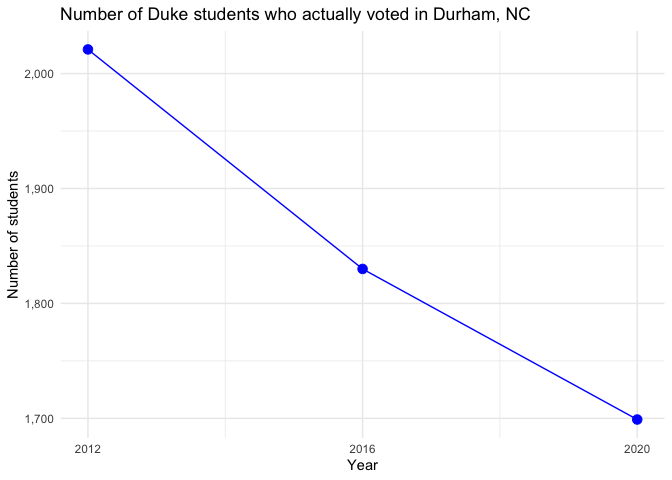
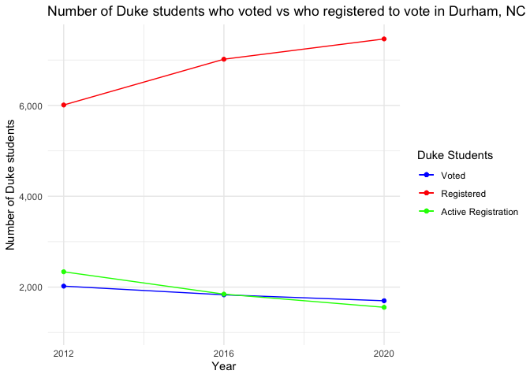

Final Memo
================
Margaret Reed
4/15/2022

### Intro

Many of the ‘bluest’ cities and towns in America house a variety of
universities and colleges. We began our data analysis investigation
interested in investigating the impact Duke and other university
students have on the elections of Durham and North Carolina. After
parsing and exploring the data, we came away with a couple of questions
to further pursue. How have NC Duke student registration numbers changed
over time? How does this compare with the number of Dukes students who
ended up voting in North Carolina? Likewise, we were also interested in
looking into how political party affiliations and voting habits have
changed over time.

### Methodology

To begin, we needed data. We ended up using NC voter registration data
and NC voter history data. However, nowhere in our data sets was there a
column for Duke Student: Y/N. Therefore, we needed to find some sort of
heuristic to approximate what constitutes a Duke student using the data
we had available. After some trial and error, we ended up classifying
Duke students as those whose mailing addresses were located on Duke’s
campus. The specific methodology is as follows: The mailing address must
specify a voter lives in a dorm named: “Bassett”, “Epworth”, “Few Quad”,
“Gilbert Addoms”, “Giles”, “Jarvis”, “Maxwell”, “Mirecourt”, “Pegram”,
“Randolph”, “Randolph Hall”, “Round Table”, “Southgate”, “Wayne
Manor”, “Wilson”, or “Wannamaker”. Otherwise, the street name must be
one of the following: “Duke University West Campus”, “Duke University
East Campus”, “Towerview”, “Alexander”, or “Yearby”. Finally, we also
looked at two special cases: Duke-owned apartment 300 Swift, and the few
outliers that were located on Campus Drive. All of these decisions were
driven by an exploration of the data and looking at where high numbers
of young people were concentrated near Duke’s campus. Because our
analysis only looks at registered voters in Durham county, NC- we are
not considering any of the students who may have decided to vote in
their home county or state. After classifying who Duke students were
(with a margin of error), we were ready to begin our analysis.

### Analysis

First we look into how many duke students registered to vote during
presidential election years.

<!-- -->

Interestingly, it seems as if Duke students were the most motivated to
registered to vote in the 2012 election. It would be interesting to
investigate further whether this is actually true- and dig into why, or
if this can be attributed to the methodology capturing the most duke
students during 2012.

Next we looked at Duke students who actually voted in presidential
election years.

<!-- -->

Here we compared our two data sets:

<!-- -->

Interestingly, there seemed to be more voters than those who registered
in 2020, more research is needed to understand if this is a data
collection problem, or if this could actually have been the case.

### Next Steps:

Regardless, with midterm elections coming up it is important for all the
Duke students who are interested, to feel comfortable and empowered to
register and then vote.

  - People to contact

  - duke orgs for voting/ registering on campus

  - final thoughts / conclusions
